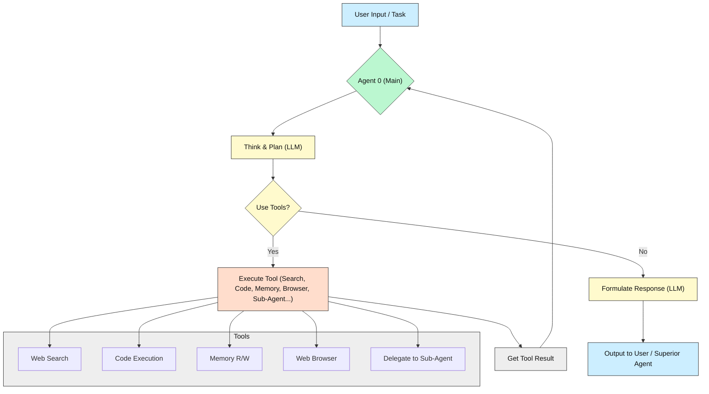
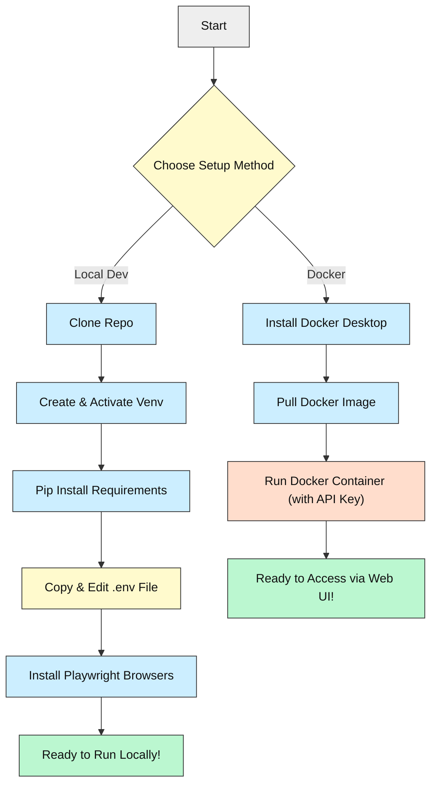

# Agent Zero: Your Personal AI Teammate

[](https://opensource.org/licenses/MIT)


[](https://github.com/frdel/agent-zero/actions)
[](https://discord.gg/B8KZKNsPpj)
[](https://www.skool.com/agent-zero)

_An AI agent framework that learns and grows alongside you. Think of it as a flexible, customizable digital brain you can teach!_

---

## What's Agent Zero All About? 🤔

Ever wished you had a smart assistant that could *actually* use your computer like you do? That's Agent Zero!

It's not just a chatbot. It's designed to be a **general-purpose agent** that can:

*   Understand your tasks (big or small).
*   Use the internet, run code, and access files on your computer to get things done.
*   Learn from past interactions to get better over time.
*   Even create *other* specialized agents to help tackle complex problems!

**Who is this for?** Anyone curious about AI agents, developers wanting a flexible framework, or prompt engineers looking to build powerful, customized assistants without getting lost in complex code (unless you want to!).

**Why is it cool?** It's transparent and highly customizable. You define its core behavior through simple text prompts!

---

## Tech Stack 🛠️

Here's what makes Agent Zero tick:

| Area             | Technologies                                                                 |
|------------------|------------------------------------------------------------------------------|
| **Core Language**| Python (>=3.10 recommended)                                                  |
| **AI/LLM**       | Integrates with many LLMs (OpenAI, Anthropic, Groq, Google, Mistral, Ollama, LM Studio, OpenRouter, Sambanova via Langchain) |
| **Web UI**       | Flask (Python web framework)                                                 |
| **Key Libraries**| Langchain, Docker, Sentence Transformers, Playwright (for browser tasks)    |
| **Databases**    | FAISS (for vector memory), potentially others via tools                      |
| **Infrastructure**| Docker (optional, for easy setup), SSH (optional, for code execution)        |

*You'll primarily interact with it via Python scripts or the Web UI.*

---

## Key Features ✨

*   🧠 **General-Purpose Assistant:** Give it almost any task - coding, research, analysis, content creation.
*   💻 **Uses Your Computer:** Can run terminal commands and Python code safely (you can configure how!).
*   🌐 **Web Browser Agent:** Can browse websites, extract info, and interact with web pages.
*   💾 **Persistent Memory:** Remembers past conversations, facts, and successful solutions.
*   🤝 **Multi-Agent Cooperation:** Can create "sub-agents" to delegate tasks and work together.
*   🔧 **Highly Customizable:** Tweak its personality, skills, and behavior by editing simple text prompts (`.md` files).
*   🗣️ **Interactive UI:** A clean web interface (and CLI) shows exactly what the agent is thinking and doing. You can interrupt and guide it anytime.
*   🔌 **Extensible:** Add your own custom tools and functions ("Instruments").

---

## How It Works: The Agent's "Mind" 🤖

Think of an agent as a loop:

1.  **Get Task:** Receives a goal from you (or another agent).
2.  **Think & Plan:** Decides how to approach the task using its available tools and memory. This involves calling an LLM.
3.  **Use Tools:** Executes actions like searching the web, running code, accessing memory, or talking to sub-agents.
4.  **Process Results:** Analyzes the outcome of its actions.
5.  **Respond/Continue:** Either provides the final answer, gives an update, or loops back to step 2 to continue working.

### System Flow Diagram



*This diagram shows the basic loop. Agents can call other agents, creating complex collaboration.*

---

## Prerequisites: What You Need First 🎒

Before you start, make sure you have:

*   **Python:** Version 3.10 or newer. [Download Python](https://www.python.org/downloads/)
    *   *Why?* Agent Zero is written in Python.
*   **Pip:** Python's package installer (usually comes with Python).
    *   *Why?* To install the libraries Agent Zero depends on.
*   **Git:** For cloning the repository. [Download Git](https://git-scm.com/downloads)
    *   *Why?* To get the code from GitHub.
*   **(Optional) Docker:** For the easiest, containerized setup. [Install Docker Desktop](https://www.docker.com/products/docker-desktop/)
    *   *Why?* Packages everything neatly, avoids local conflicts. Recommended if you know Docker, but **not required** for basic local use.
*   **LLM API Keys:** You'll need an API key from at least one provider (like OpenAI, Anthropic, Groq, Ollama running locally, etc.).
    *   *Why?* Agent Zero uses these AI models as its "brain". Get keys from their respective websites.

---

## Setup: Get Agent Zero Running! 🚀 (~15 mins)

Choose the path that suits you best:

### Option 1: Local Setup with Virtual Environment (Good for tinkering!)

This keeps Agent Zero's libraries separate from your system Python.

1.  **Clone the Code:**
    ```bash
    git clone https://github.com/frdel/agent-zero.git
    cd agent-zero
    ```

2.  **Create a Virtual Environment:**
    *(Choose one)*
    *   Using `venv` (built-in):
        ```bash
        python -m venv venv
        # Activate it:
        # Windows (cmd/powershell):
        .\venv\Scripts\activate
        # Linux/macOS (bash/zsh):
        source venv/bin/activate
        ```
    *   Using `conda`:
        ```bash
        conda create -n agentzero python=3.10 # Or newer
        conda activate agentzero
        ```
    *You should see `(venv)` or `(agentzero)` at the start of your terminal prompt.*

3.  **Install Dependencies:**
    ```bash
    pip install -r requirements.txt
    ```
    *This might take a few minutes.*

4.  **Set Up Configuration:**
    *   Copy the example environment file:
        ```bash
        # Windows
        copy example.env .env
        # Linux/macOS
        cp example.env .env
        ```
    *   **Edit the `.env` file** with a text editor.
    *   Add your **API key(s)** (e.g., `API_KEY_OPENAI=sk-yourkeyhere`). You only need one to start.
    *   Configure other settings if needed (like local model URLs if using Ollama/LM Studio).

5.  **(First Time Only) Install Playwright Browsers:**
    *   Agent Zero uses Playwright for its browser agent. Install its necessary browser binaries:
        ```bash
        playwright install --with-deps chromium
        ```
    *   *Why?* This downloads a Chromium browser instance that the agent can control.

✅ **You're ready to run!** Skip to the "Running the Project" section.

### Option 2: Docker Setup (Easiest, Recommended for Beginners)

This runs Agent Zero in a self-contained package.

1.  **Make sure Docker Desktop is installed and running.**

2.  **Pull the Pre-built Image:**
    ```bash
    docker pull frdel/agent-zero-run
    ```

3.  **Run the Container:**
    ```bash
    docker run -p 50001:80 --name agent-zero-container -e API_KEY_OPENAI="sk-yourkeyhere" frdel/agent-zero-run
    ```
    *   Replace `"sk-yourkeyhere"` with your actual OpenAI API key (or use other `_KEY_` variables like `-e API_KEY_GROQ="your_groq_key"`). You can add multiple `-e` flags for different keys.
    *   This command maps port `50001` on your machine to port `80` inside the container.
    *   The agent will be available via the Web UI (see below).

✅ **You're ready to run!** Access the Web UI.

---

## Visual Setup Guide 🗺️

Here's a map of the setup process:



---

## Running the Project ▶️

How you run Agent Zero depends on your setup:

*   **If using Local Setup:**
    *   **Web UI (Recommended):** Open your activated terminal and run:
        ```bash
        python run_ui.py
        ```
        Then open your web browser to `http://localhost:5000` (or the port shown in the terminal, usually 5000 or 50001).
    *   **Command Line Interface (CLI):**
        ```bash
        python run_cli.py --task "Your task description here"
        ```
        Replace the text in quotes with your actual task.

*   **If using Docker Setup:**
    *   The Web UI is automatically started. Open your web browser to `http://localhost:50001` (the port you mapped in the `docker run` command).

---

## Configuration & API Keys 🔑

*   **`.env` File (Local Setup):** This file holds your secrets and settings. NEVER share it or commit it to Git!
    *   `API_KEY_PROVIDERNAME`: Put your keys here (e.g., `API_KEY_OPENAI`, `API_KEY_ANTHROPIC`).
    *   `OLLAMA_BASE_URL`, `LM_STUDIO_BASE_URL`: If using local models, point these to your local server (e.g., `http://localhost:11434`).
    *   `WEB_UI_PORT`: Change the port for the web UI if needed.
*   **Environment Variables (Docker Setup):** Pass configuration using the `-e` flag in `docker run` (e.g., `-e API_KEY_OPENAI="sk-..." -e OLLAMA_BASE_URL="http://host.docker.internal:11434"`).
*   **Why Keys?** Agent Zero needs these keys to access the powerful Large Language Models that act as its core intelligence. Without them, it can't think or understand instructions.

---

## Project Status & Roadmap 🚦

*   ✅ **Core Agent Loop:** Thinking, planning, tool use.
*   ✅ **Web UI & CLI:** Interactive interfaces.
*   ✅ **Basic Tools:** Web search, code execution, memory, browser agent.
*   ✅ **Multi-Agent Delegation:** Agents can create sub-agents.
*   ✅ **Persistent Memory:** Learns over time.
*   ✅ **Docker Support:** Easy deployment.
*   ✅ **Customizable Prompts:** Control agent behavior.
*   ⏳ **Knowledge/RAG Tools:** Working on better ways to feed documents to the agent.
*   ⏳ **Planning & Scheduling:** Improving long-term task management.
*   ⚠️ **Code Execution Risk:** Be careful! The agent can run code. Run in Docker or a safe environment if unsure. Always review the code it wants to execute if possible.
*   🔜 **More Tools & Integrations:** Always expanding capabilities.

---

## How AI Helped Build This 🤖✨

Agent Zero itself was developed with significant help from AI!

*   LLMs helped brainstorm architectural designs.
*   AI pair programming assisted in writing and debugging code modules (especially for complex things like tool integration and async operations).
*   AI helped generate documentation drafts and explanations.

It's a testament to how AI can accelerate and enhance software development!

---

## License 📜

This project is licensed under the **MIT License**. See the [LICENSE](./LICENSE) file for details.

---

## Community & Support 🤗

Got questions? Ideas? Found a bug?

*   **Join the Discussion:**
    *   [Discord Server](https://discord.gg/B8KZKNsPpj)
    *   [Skool Community](https://www.skool.com/agent-zero)
*   **Report Issues:** [GitHub Issues](https://github.com/frdel/agent-zero/issues)
*   **Learn More:** [Agent Zero YouTube Channel](https://www.youtube.com/@AgentZeroFW)

We welcome feedback and contributions from everyone, especially beginners! Don't hesitate to reach out.

---

# _Build your own personal AI teammate!_ 
